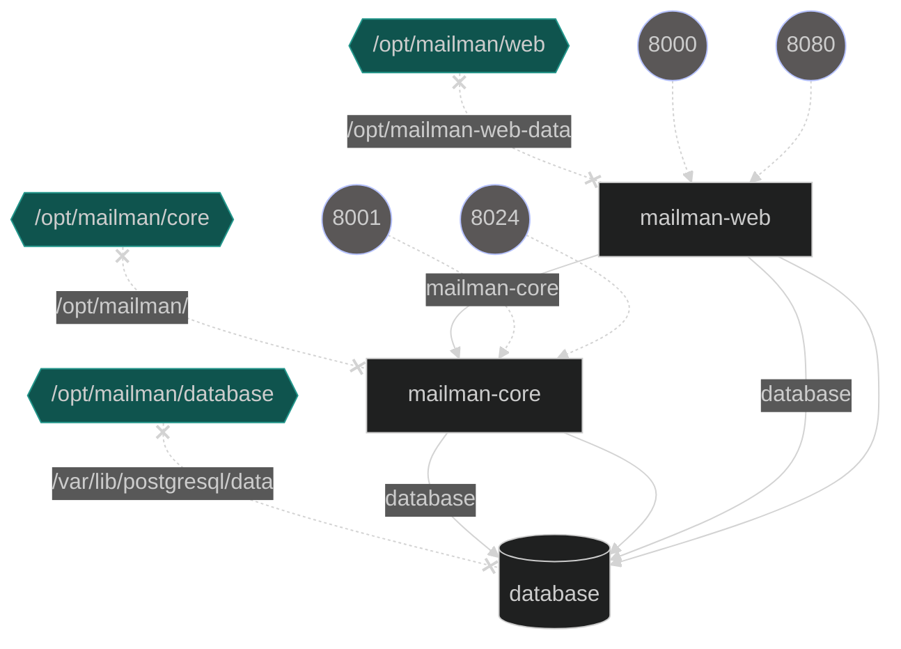

```mermaid
%%{init: {'theme': 'dark'}}%%
flowchart TB
  Voptmailmancore{{/opt/mailman/core}} x-. /opt/mailman/ .-x mailmancore[mailman-core]
  Voptmailmanweb{{/opt/mailman/web}} x-. /opt/mailman-web-data .-x mailmanweb[mailman-web]
  Voptmailmandatabase{{/opt/mailman/database}} x-. /var/lib/postgresql/data .-x database[(database)]
  mailmancore -- database --> database
  mailmancore --> database
  mailmanweb -- mailman-core --> mailmancore
  mailmanweb -- database --> database
  mailmanweb --> database
  P0((8001)) -.-> mailmancore
  P1((8024)) -.-> mailmancore
  P2((8000)) -.-> mailmanweb
  P3((8080)) -.-> mailmanweb

  classDef volumes fill:#0f544e,stroke:#23968b
  class Voptmailmancore,Voptmailmanweb,Voptmailmandatabase volumes
  classDef ports fill:#5a5757,stroke:#b6c2ff
  class P0,P1,P2,P3 ports
```